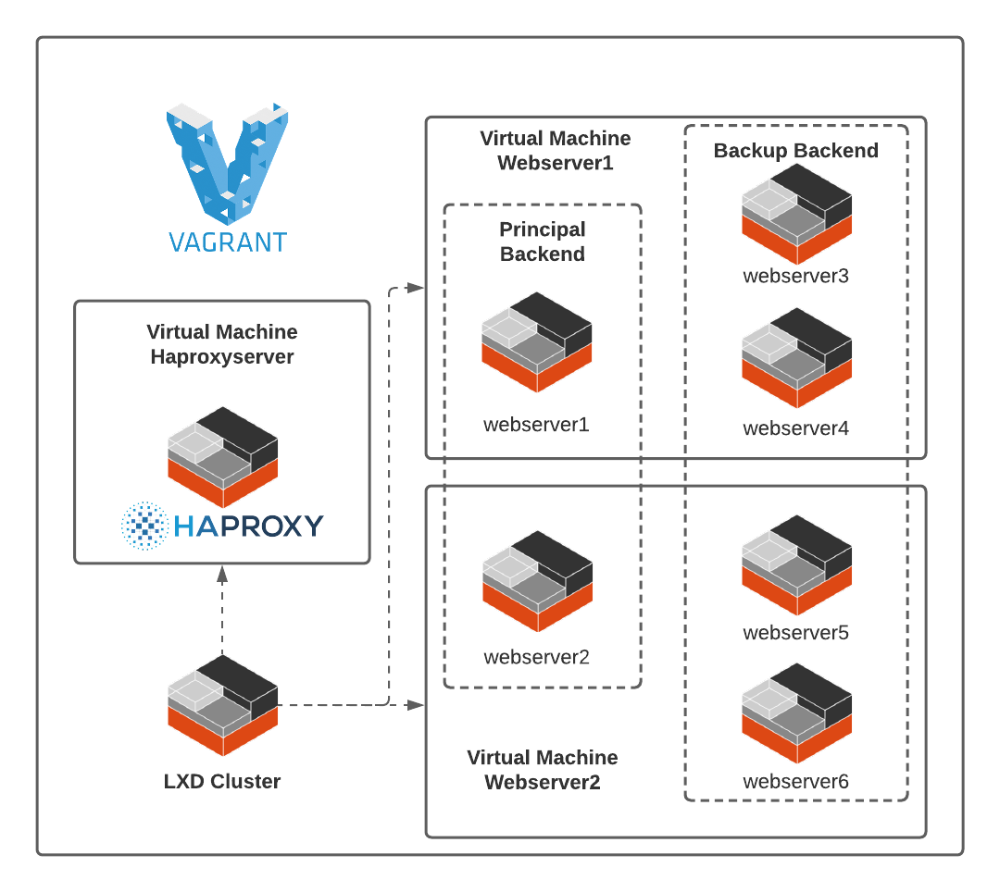

# Haproxy and linux containers

_In this repository, you can find step by step to run a test scenario, described in the following image_



## System Prerequisites 📋

_Below are the system prerequisites:_

* 8Gb of RAM at least
* 2.4GHz processor or higher
* [Git](https://git-scm.com/downloads) - Git
* [Virtual Box](https://www.virtualbox.org/wiki/Downloads) - Virtualization software.
* [Vagrant](https://www.vagrantup.com/downloads.html) - Virtual machine management tool.


### Install Environment

- Clone the following repository by using the statement:
```
git clone https://github.com/hfmartinez/haproxy.git
```

- Inside the repository folder that contains the Vagrantfile, start the virtual machines: 
```
vagrant up
```

- After the installation, enter the path http://192.168.80.20 and check the operation:
